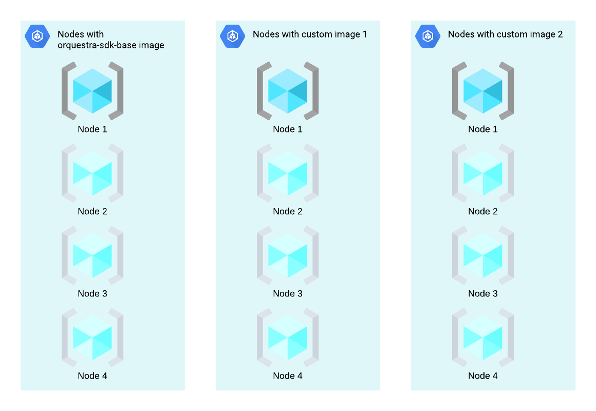

Using Custom Container Images on Compute Engine
===============================================

When running workflows remotely on Compute Engine, your tasks run in a container that uses one of the
``orquestra-sdk-base`` images depending on whether the ``sdk.task`` requires a GPU resource or not (you can see their source code
`here <https://github.com/zapatacomputing/orquestra-workflow-sdk/blob/main/docker/Dockerfile>`_ and
`here <https://github.com/zapatacomputing/orquestra-workflow-sdk/blob/main/docker/cuda.Dockerfile>`_). These images
are automatically selected based on the workflow's SDK version. If your task needs extra dependencies that you
cannot install using imports (such as native libraries or executable binaries), you can use one of the above images
as your base image to publish a new image that you will use as your container when running your task.

Building an Image
-----------------

The base images are hosted at Orquestra Nexus. There are two versions of the base image per each SDK version, one with
CUDA dependencies installed and one without. Their names follow the pattern
``hub.nexus.orquestra.io/zapatacomputing/orquestra-sdk-base:<SDK version>[-cuda]``. For example,
``hub.nexus.orquestra.io/zapatacomputing/orquestra-sdk-base:0.48.0`` or
``hub.nexus.orquestra.io/zapatacomputing/orquestra-sdk-base:0.49.0-cuda``. You should pick the one that matches
your SDK version and your GPU needs (``-cuda`` needs to be picked for GPU workflows).

.. note::

    It is the responsibility of the author of the custom image to keep the image up to date with new SDK versions.

The base images run as a user named ``orquestra`` with uid ``1000``. Since these are Ubuntu based images, you
can install any package that you need from Ubuntu repositories (by doing ``RUN apt install <package name>``).
However, before doing so, you need to temporarily switch to the root user (via ``USER root`` directive) and
restore back to user ``orquestra`` once you're done (``USER orquestra``).

A virtual environment for the Python code is created at `/home/orquestra/venv`. Orquestra SDK and Ray modules are installed
in this virtual environment. The `bin` directory of this virtual environment is added to the `PATH` environment variable
as well so that you use the same Python executable in any subprocesses you might create in your code.

.. note::

    You can use `standard OCI annotations <https://github.com/opencontainers/image-spec/blob/main/annotations.md>`_ to add metadata to your images.

In order for the Compute Engine to run your workflow code, you should not have a ``ENTRYPOINT`` or ``CMD`` statement in
your images. In case you do, these will be overriden at run time and you might observe unexpected behavior.

Publishing the Image
--------------------

Once you have your ``Dockerfile`` ready, you can publish your image to our Nexus repository by using standard Docker tools.
Please refer to `this page <https://zapatacomputing.atlassian.net/wiki/spaces/PRO/pages/619577422/Nexus+Users+Guide>`_
to see how.

Using the Image on Compute Engine
---------------------------------

.. note::

    You can run workflows that use custom images only on Compute Engine and not on Quantum Engine or locally.

When you use a custom image, ``nodes`` workflow resource indicates the maximum number of nodes that may be allocated
with the custom image, if needed. For example, if you use two different custom images for your tasks and specify ``nodes=4``
in your workflow resources, a maximum of 12 nodes will be created (note the addition of default image). As in the case
without any custom images, containers will get created and destroyed based on resource requests from tasks.
See the diagram below which shows the example scenario with two different custom images:

To make your task use a custom image on Compute Engine, you need to pass a ``custom_image`` argument to the
``@sdk.task()`` decorator as shown below:

.. code-block::
    :caption: Custom image example

    @sdk.task(
        custom_image="hub.nexus.orquestra.io/users/emre-aydin/my-custom-image:1.2.3"
    )
    def train_model(x, y) -> LinearRegression:
        ...
