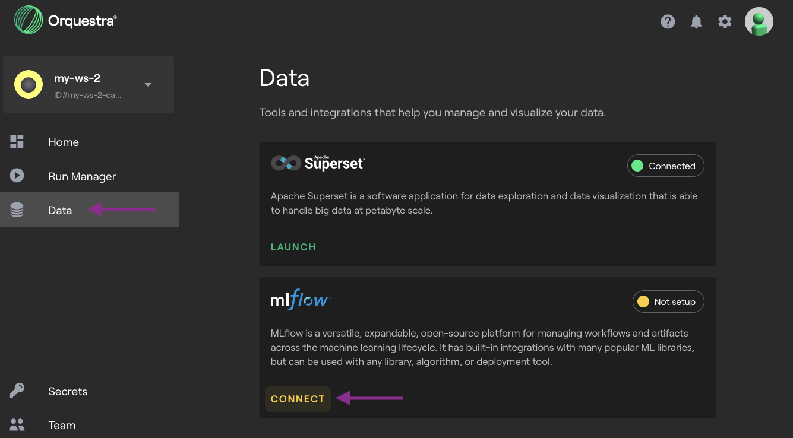

MLflow In Orquestra
===================

Orquestra Platform comes with an `MLflow <https://mlflow.org/>`_ tracking server instance available for each workspace.
To enable it, visit Orquestra Portal (your cluster's URL) > open a workspace > *Data* > click the *Connect* button.

Connecting From Python
----------------------

MLflow provides their own `Python client library <https://pypi.org/project/mlflow/>`_.
Using a remote tracking server requires setting the tracking server URI and token.
MLflow client expects these values to be present as environment variables.
See also: `MLflow docs <https://mlflow.org/docs/latest/tracking.html#logging-to-a-tracking-server>`_.

The Workflow SDK comes with utility functions that figure out the appropriate tracking URI and token for accessing the tracking server instance deployed on an Orquestra cluster.

.. literalinclude:: ../examples/tests/test_mlflow_utilities.py
    :start-after: def tracking_uri_token():
    :end-before: </snippet>
    :language: python
    :dedent: 8

When used on a local machine, the utility functions make use of the cluster URI and token stored in the config you created when :doc:`logging in<../tutorials/remote>`.

When used in Orquestra Studio or within a task running on CE, the utility functions ignore the ``cluster_name=`` argument, and use a different mechanism for cluster-local URIs and auth.

Passing in ``workspace_id`` to ``get_tracking_uri()`` is required regardless of the execution environment.

Connecting From A Task
----------------------

The ``mlflow`` client reads auth URI and token from environment variables.
Global state isn't retained between task runs [#f1]_, so you should set the environment variables inside each task that uses MLflow.

.. literalinclude:: ../examples/tests/test_mlflow_utilities.py
    :start-after: def tracking_task():
    :end-before: </snippet>
    :language: python
    :dedent: 8

.. [#f1] Global state can leak between task runs if subsequent task runs are executed in the same Python process.
         This global state leakage can happen if two tasks have the same ``@sdk.task(...)`` decorator arguments and the Ray scheduler decides to reuse the same worker process, or if you're using the ``in_process`` runtime.
         It's best to assume the global state set by one task run won't be available to other task runs.

Uploading Artifacts
-------------------

MLflow artifacts must be written to a file before being uploaded to an MLflow tracking server.
The problem is: it's not always obvious what's a suitable local directory for writing such files, especially on the remote runtime.
The Workflow SDK provides a ``get_temp_artifacts_dir()`` utility.
This function can be used in any execution environment (local, Studio, CE) and will return an appropriate directory for storing temporary files, suitable for use with MLflow.

.. literalinclude:: ../examples/tests/test_mlflow_utilities.py
    :start-after: # <artifacts_dir_snippet>
    :end-before: </snippet>
    :language: python
    :dedent: 8

Compute Engine and Studio both configure temporary directories automatically.
For local workflows, the default location is ``~/.orquestra/mlflow/artifacts``, however this can be overridden by setting the ``ORQ_MLFLOW_ARTIFACTS_DIR`` environment variable.

