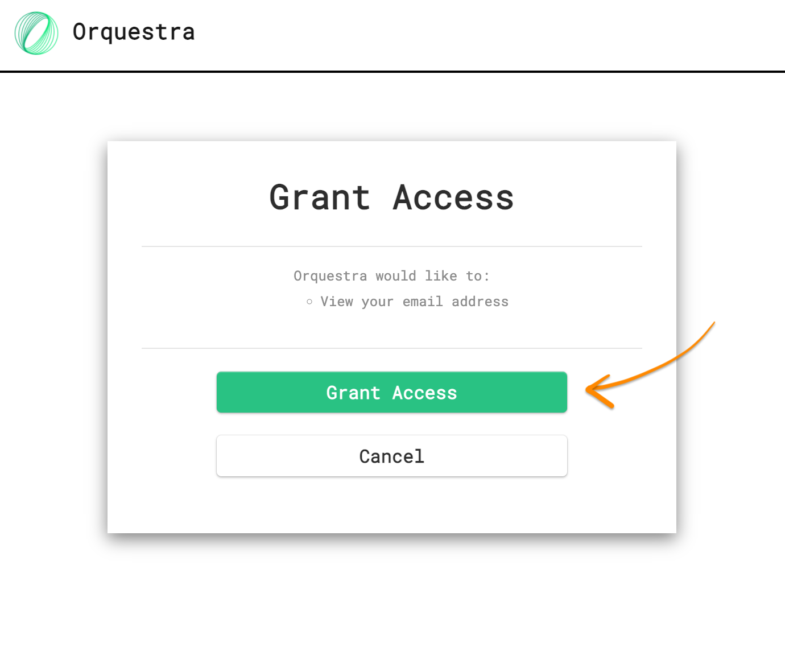

================
Remote Workflows
================
To access more compute power - you can submit your workflow to a remote runtime.

Prerequisites
=============

#. You've :doc:`installed Orquestra Workflow SDK<installing-macos-linux>`.
#. You have access to remote QE cluster

Log In to Your Orquestra Account
================================

Before running a remote workflow, you will need to know the email address and password for your Orquestra account as well as the URL of your Orquestra cluster.
If you do not have these, reach out to your point of contact at Zapata.

.. only:: internal

    .. note::
        If you are a Zapata employee, ask your manager which cluster you should use. You can request access to a cluster through the `Zapata Cloud Support portal <https://zapatacomputing.atlassian.net/servicedesk/customer/portal/4/group/14/create/35>`_.

Run the command below to log in to an Orquestra cluster (using the appropriate cluster URL):

.. code:: bash

    orq login -s https://<cluster-name>.orquestra.io

This command will provide you a login URL and a prompt to provide a token.
Open the URL in your browser (command + double-click on macOS).
Click on the "Login with Orquestra" button.

.. image:: images/orq-login-landing-page.png
    :width: 75%
    :align: center

You will then be able to log in using your username and password.
After logging in, click the "Grant Access" button as shown below.

The webpage will now provide you with a token.
Click the "Copy" button to copy it as shown below.

.. image:: images/orq-login-copy-token.png
    :width: 75%
    :align: center

Define Configuration
====================

To work with remote clusters, Server URI and Token needs to be saved as part of the configuration.
As Token is considered sensitive data, it is highly recommended to avoid keeping it inside any kind of repository or production code.
Token and URI should be stored in local configuration file. To do this, execute following command:

.. code:: bash

    orq login -s https://<cluster-name>.orquestra.io -t <paste token content>

.. warning::

    Under no circumstances you should commit configuration file or token itself to any git repository
    or anywhere else when anyone could see it.

Create the Workflow Definition
==============================

Create a file ``remote_workflow.py`` containing:

.. literalinclude:: ../examples/tests/test_remote.py
    :start-after: def workflow_defs():
    :end-before: </snippet>
    :language: python
    :dedent: 8

Submit the Workflow
===================

The workflow can be submitted to the remote runtime using this script:

.. literalinclude:: ../examples/tests/test_remote.py
    :start-after: def execute_workflow():
    :end-before: </snippet>
    :language: python
    :dedent: 8

Retrieve Results
================

Execute this script to wait for the workflow to complete and print the output:

.. literalinclude:: ../examples/tests/test_remote.py
    :start-after: def get_results():
    :end-before: </snippet>
    :language: python
    :dedent: 8

Make sure replace the workflow run ID in this example with the ID of your workflow run.
